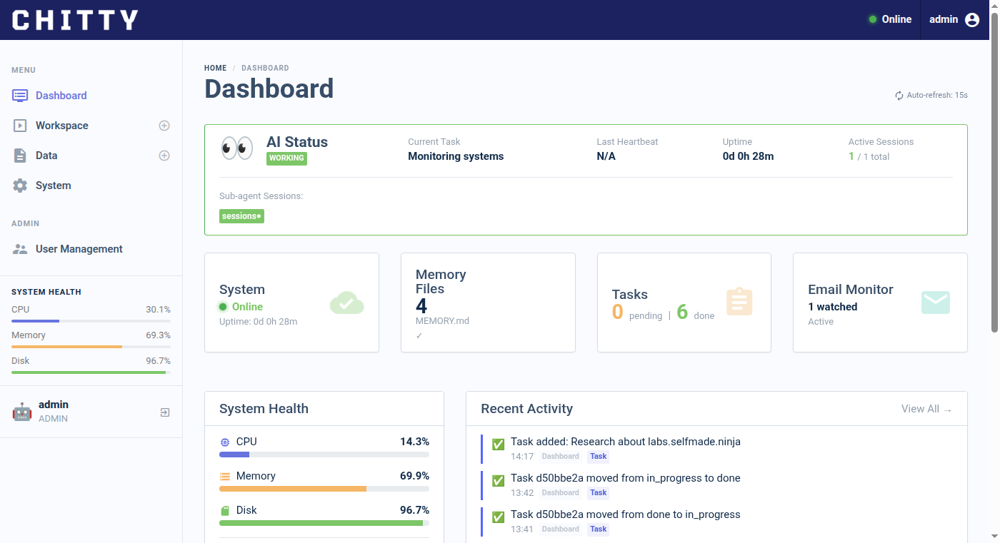
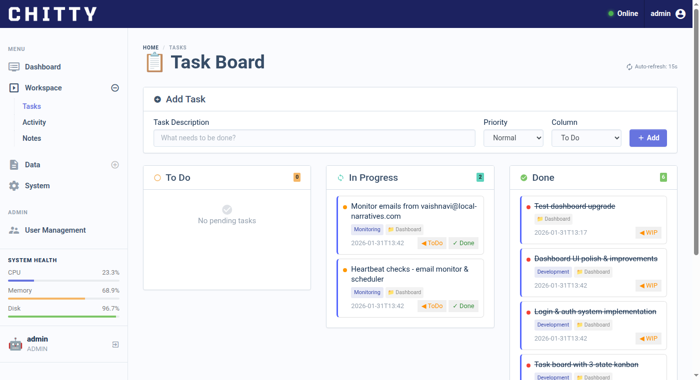
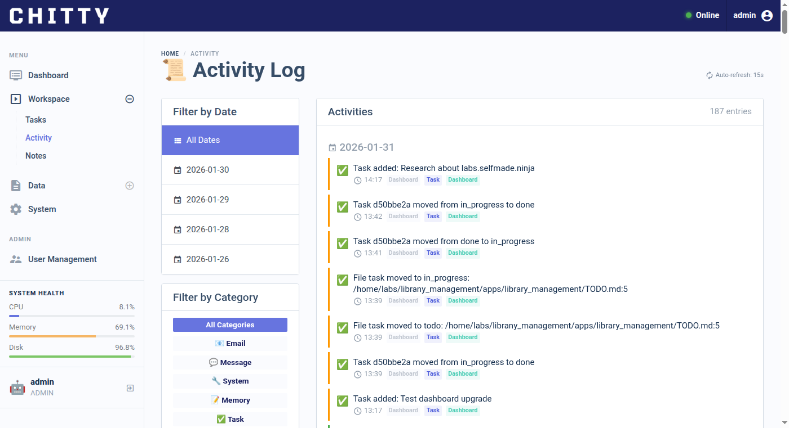
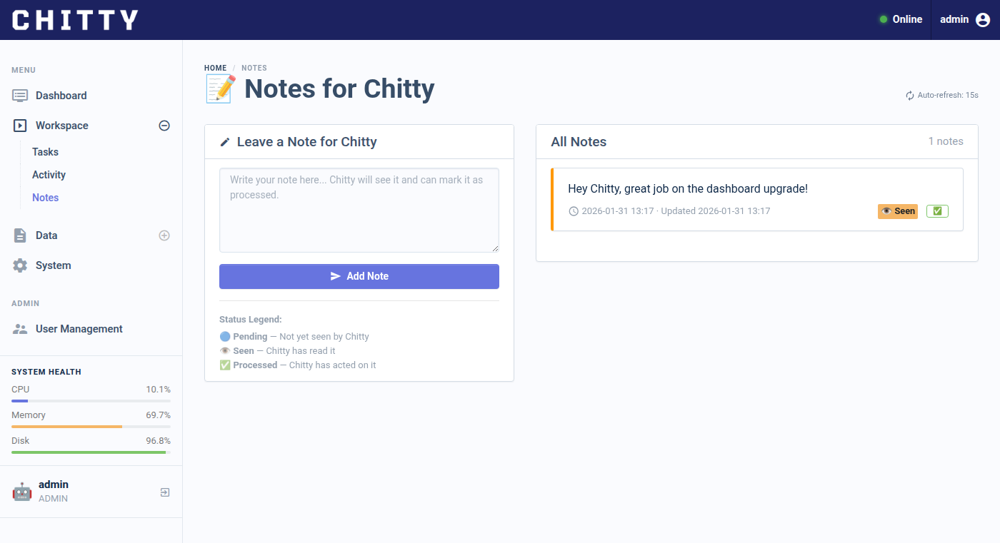

# 🤖 Chitty Dashboard

A real-time AI assistant monitoring dashboard built with **Flask + Jinja2** and a modern Bootstrap admin template.

Monitor your AI assistant's status, tasks, activity, notes, documents, emails, memory, and system health — all from a clean, responsive web interface.



---

## ✨ Features

| Page | Description |
|------|-------------|
| **📊 Dashboard** | Real-time AI status with emoji indicators, quick stats, recent activity |
| **✅ Tasks** | Kanban-style task board with 3 columns (Todo → In Progress → Done) |
| **📋 Activity** | Live activity log with auto-refresh, filterable entries |
| **📝 Notes** | Human ↔ AI communication panel — leave notes, mark as seen/processed |
| **📄 Docs** | Document browser with markdown rendering |
| **📧 Emails** | Email monitoring integration — track watched senders |
| **🧠 Memory** | Browse AI memory files (daily logs + long-term memory) |
| **💻 System** | System health monitoring — CPU, RAM, disk, uptime, processes |
| **🔐 Admin** | User management panel (admin-only user creation) |

### Additional Features
- 🔒 **Authentication** — Session-based login with password hashing
- 🔄 **Auto-refresh** — Pages update via JS fetch without full reload
- 🎨 **Responsive UI** — Bootstrap-based, works on mobile
- 📡 **REST API** — JSON endpoints for all data (status, tasks, notes, activity)
- 🎯 **Priority system** — Tasks support high/normal/low priority with visual indicators
- 🤖 **Emoji status** — Cute animated emojis based on what the AI is doing

---

## 🛠 Tech Stack

- **Backend:** Python 3, Flask
- **Templating:** Jinja2
- **Frontend:** Bootstrap admin template, jQuery, Chart.js
- **Auth:** Werkzeug security (password hashing)
- **System monitoring:** psutil
- **Markdown:** markdown2
- **Data storage:** JSON files (no database required)

---

## 🚀 Installation

```bash
# Clone the repo
git clone https://github.com/Venkateshvenki404224/chitty-dashboard.git
cd chitty-dashboard

# Create virtual environment
python3 -m venv venv
source venv/bin/activate

# Install dependencies
pip install -r requirements.txt

# Configure environment
cp .env.example .env
# Edit .env with your values (see Configuration below)

# Run the dashboard
python app.py
```

The dashboard will be available at **http://localhost:5001**

### Default Login
- **Username:** `admin`
- **Password:** `chitty@2026`

> The default admin account is auto-created on first run. Change the password in `.env` before deploying.

---

## ⚙️ Configuration

All settings are managed via a **`.env` file**.

```bash
cp .env.example .env
nano .env
```

| Variable | Description | Default |
|----------|-------------|---------|
| `SECRET_KEY` | Flask session secret key | `change-me-in-production` |
| `FLASK_HOST` | Bind address | `0.0.0.0` |
| `FLASK_PORT` | Dashboard port | `5001` |
| `FLASK_DEBUG` | Enable debug mode | `false` |
| `ADMIN_USERNAME` | Default admin username | `admin` |
| `ADMIN_PASSWORD` | Default admin password | `chitty@2026` |
| `WORKSPACE_DIR` | AI workspace directory | `/home/labs/clawd` |
| `SESSIONS_DIR` | Clawdbot sessions directory | `~/.clawdbot/agents/main/sessions` |
| `EMAIL_ACCOUNT` | Email for monitoring (optional) | _(empty)_ |
| `EMAIL_PASSWORD` | Email app password (optional) | _(empty)_ |
| `WATCHED_SENDERS` | Comma-separated email:context pairs | _(empty)_ |

> **Note:** `.env` is gitignored and will never be committed.

---

## 📸 Screenshots

| Dashboard | Task Board |
|-----------|------------|
|  |  |

| Activity Log | Notes Panel |
|-------------|-------------|
|  |  |

---

## 📁 Project Structure

```
chitty-dashboard/
├── app.py                  # Main Flask application
├── config.py               # Configuration settings
├── requirements.txt        # Python dependencies
├── .env.example            # Environment variables template
├── data/                   # Runtime data (JSON storage)
│   ├── tasks.json          # Task board state
│   ├── notes.json          # Notes between human & AI
│   ├── status.json         # Current AI status (gitignored)
│   ├── users.json          # User accounts (gitignored)
│   └── activity.log        # Activity log (gitignored)
├── utils/                  # Backend utility modules
│   ├── auth.py             # Authentication & sessions
│   ├── activity.py         # Activity logging
│   ├── docs.py             # Document browser
│   ├── emails.py           # Email monitoring
│   ├── memory.py           # Memory file reader
│   ├── notes.py            # Notes management
│   ├── status.py           # AI status tracking
│   ├── system.py           # System health checks
│   └── tasks.py            # Task board logic
├── templates/              # Jinja2 HTML templates
├── static/                 # Static assets (CSS, JS, images)
└── screenshots/            # README screenshots
```

---

## 📡 API Endpoints

| Endpoint | Method | Description |
|----------|--------|-------------|
| `/api/status` | GET | Current AI status |
| `/api/status` | POST | Update AI status |
| `/api/tasks` | GET | All tasks |
| `/api/tasks` | POST | Create task |
| `/api/tasks/<id>/move` | POST | Move task between columns |
| `/api/notes` | GET | All notes |
| `/api/notes` | POST | Create note |
| `/api/notes/<id>/status` | POST | Update note status |
| `/api/activity` | GET | Activity log entries |

All API endpoints require authentication.

---

## 📄 License

MIT License

---

Built with ❤️ by Chitty 🤖
